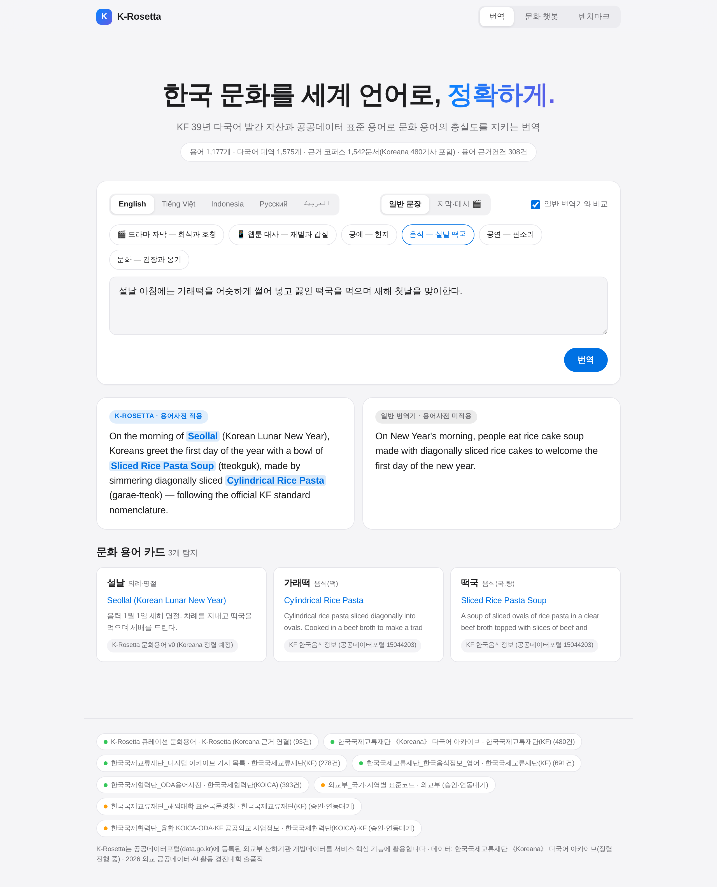

# K-Rosetta

**한국 문화를 세계 언어로, 정확하게.** — 공공데이터 기반 문화용어 AI 로컬라이제이션
(2026 외교 공공데이터·AI 활용 경진대회 제품·서비스 개발 부문 출품작)



## 🚀 데모 실행 (5분, 무료)

요구사항: Python 3.10+ (Windows/Mac/Linux 무관)

```bash
git clone https://github.com/SEUNGMINSHIN7277/shiver.git
cd shiver

# 1) 의존성
pip install -r backend/requirements.txt -r pipeline/requirements.txt

# 2) 데이터베이스 빌드 (공공데이터 CSV → SQLite, ~5초)
python pipeline/build_db.py
python pipeline/build_benchmark.py

# 3) 서버 실행
python -m uvicorn backend.app.main:app --port 8777
```

브라우저에서 **http://localhost:8777** 접속.

- **번역 탭**: 예시 칩(🎬 드라마 자막, 음식—설날 떡국 등) 클릭 → "일반 번역기와 비교" 체크 상태로
  좌우 비교. 아무 한국어 문장이나 입력해도 문화용어 탐지+표준 대역 카드는 동작
- **문화 챗봇 탭**: 예시 질문 클릭 또는 자유 질문("프린스턴대 한국학 소식 알려줘",
  "Что такое 온돌?" 등) — 출처 인용 확인
- **벤치마크 탭**: 언어 필터(EN/VI/ID/RU)로 저자원 언어 결과 확인

`make demo` 한 줄로도 실행됩니다(macOS/Linux). 테스트: `make test` (pytest 17건).

## 🔑 선택 설정 (.env)

`.env.example`을 복사해 `.env` 생성. **키가 없어도 전 기능 데모가 동작**합니다(cached 모드).
`DATA_GO_KR_API_KEY`는 오픈API 라이브 연동 시연용(무료 발급).

## 📦 Koreana 파일럿 코퍼스 결합 (한국 IP 필요)

koreana.or.kr은 해외 트래픽을 차단하므로 크롤링은 한국 내 PC에서만 가능합니다:

```bash
python scripts/run_pilot_crawl.py          # 30~60분, 방치 가능
python pipeline/build_db.py                # 재빌드 → 코퍼스 편입 + 다국어 근거 자동 연결
git add data/pilot && git commit -m "pilot corpus" && git push
```

결합 경로는 합성 fixture 기반 통합 테스트로 사전 검증되어 있습니다
(`pipeline/tests/test_pilot_integration.py`).

## 📚 문서

| 문서 | 내용 |
|---|---|
| `docs/DEV_SPEC.md` | 개발명세서 (아키텍처·파이프라인·API·마일스톤) |
| `docs/GRAND_PRIZE_PLAN.md` | 기획서 반영도 감사 + 고도화 계획 |
| `docs/SUBMISSION_기획서_초안.md` | 공모 접수용 기획서 초안 (붙임3 양식 대응) |
| `docs/PROGRESS.md` | 세션별 진행 현황 |
| `CLAUDE.md` | Claude Code 자율 개발 운영 지침 |

## 활용 공공데이터 (공공데이터포털 등록)

한국국제교류재단_한국음식정보_영어(15044203) · 한국국제협력단_ODA용어사전(15052909) ·
한국국제교류재단_디지털 아카이브 기사 목록(15139278) · KF 해외대학 표준국문명칭(15075335) ·
외교부 국가·지역별 표준코드(15075346) · KOICA-KF 융합 사업정보(15099215)
